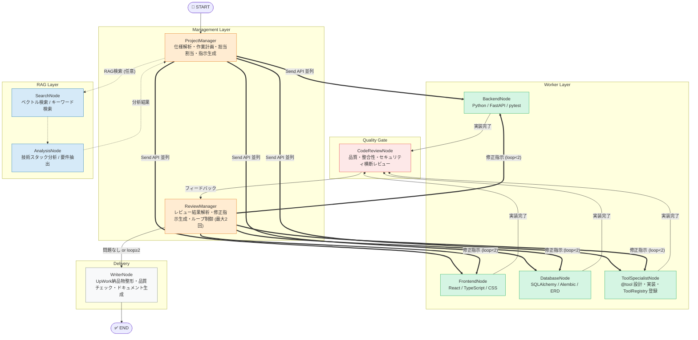
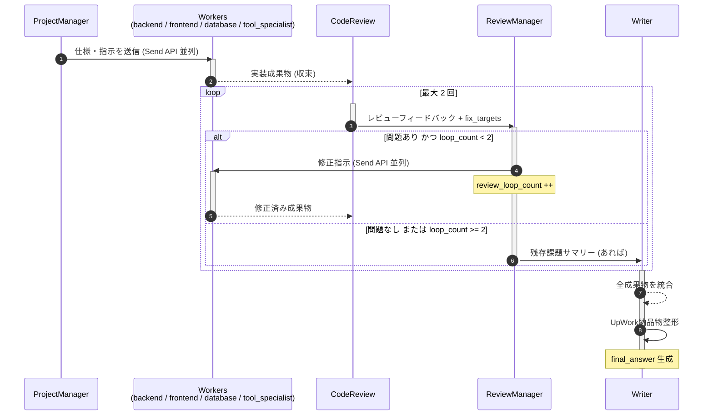
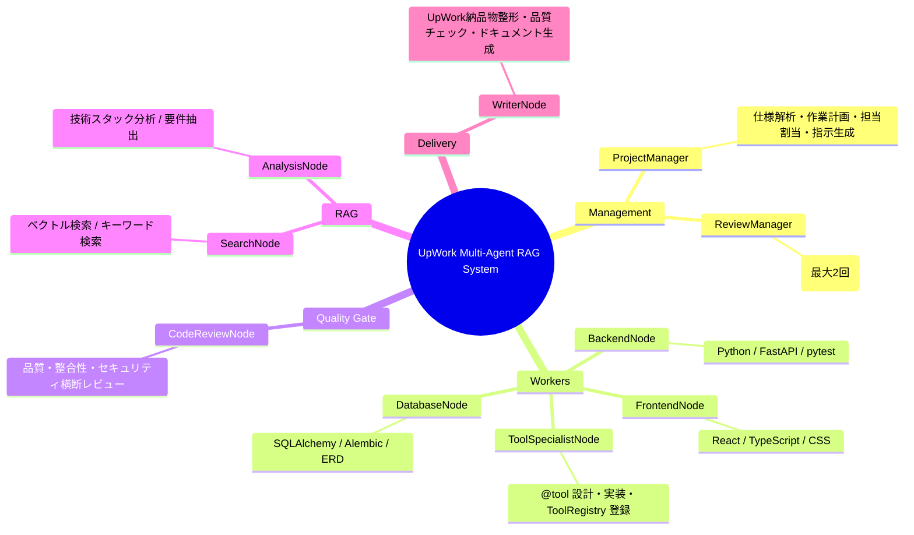
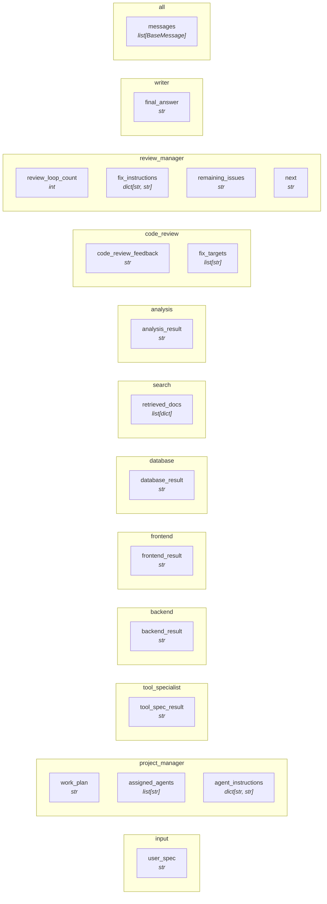

# UpWork Multi-Agent RAG System — Architecture
> **Version:** 1.3.0  |  **Generated:** 2026-06-19 12:53 UTC  |  **Source:** `graph/diagram_spec.py`

> [!WARNING]
> このファイルは自動生成です。直接編集しないでください。
> 変更は `graph/diagram_spec.py` を更新してから `python tools/generate_diagram.py` を実行してください。

---
## 1. システム全体フロー



**凡例**
| 矢印 | 意味 |
|---|---|
| `-->` | 通常遷移 |
| `==>` | Send API 並列実行 |
| `-.->` | オプション (RAG) |
---
## 2. コードレビューループ シーケンス

> 実装 ↔ レビュー のループは最大 **2 回** に制限されます。


---
## 3. エージェント役割 マインドマップ


---
## 4. AgentState データフロー

> 各フィールドがどのエージェントによって書き込まれるかを示します。



### State フィールド一覧

| フィールド | 型 | 書き込みノード | 説明 |
|---|---|---|---|
| `messages` | `list[BaseMessage]` | `all` | 会話履歴 (add_messages reducer) |
| `user_spec` | `str` | `input` | UpWork クライアント仕様テキスト |
| `work_plan` | `str` | `project_manager` | 作業計画書 |
| `assigned_agents` | `list[str]` | `project_manager` | 担当エージェント名リスト |
| `agent_instructions` | `dict[str, str]` | `project_manager` | エージェント別指示文 |
| `tool_spec_result` | `str` | `tool_specialist` | ToolSpecialist 成果物 |
| `backend_result` | `str` | `backend` | BackendNode 成果物 |
| `frontend_result` | `str` | `frontend` | FrontendNode 成果物 |
| `database_result` | `str` | `database` | DatabaseNode 成果物 |
| `retrieved_docs` | `list[dict]` | `search` | ベクトル検索結果 |
| `analysis_result` | `str` | `analysis` | 技術分析結果 |
| `code_review_feedback` | `str` | `code_review` | 横断コードレビュー結果 |
| `fix_targets` | `list[str]` | `code_review` | 修正が必要なエージェントリスト |
| `review_loop_count` | `int` | `review_manager` | レビューループ回数 (上限2) |
| `fix_instructions` | `dict[str, str]` | `review_manager` | エージェント別修正指示文 |
| `remaining_issues` | `str` | `review_manager` | ループ上限後の残存課題 |
| `next` | `str` | `review_manager` | ルーティングシグナル |
| `final_answer` | `str` | `writer` | UpWork 提出フォーマット納品物 |
---
## 5. @tool カタログ

> 全エージェント合計 **47 ツール**

| エージェント | @tool 一覧 | 数 |
|---|---|---|
| **ProjectManager** | `parse_requirements` / `create_work_plan` / `assign_agents` / `generate_agent_instruction` | 4 |
| **ReviewManager** | `prioritize_issues` / `generate_fix_instruction` / `should_escalate` / `summarize_remaining_issues` | 4 |
| **BackendNode** | `design_api` / `write_python_code` / `design_database_schema` / `write_tests` / `write_requirements` / `generate_dockerfile` | 6 |
| **FrontendNode** | `design_ui` / `write_html_css` / `write_javascript` / `generate_components` / `integrate_api` / `generate_assets_config` | 6 |
| **DatabaseNode** | `design_erd` / `generate_sqlalchemy_models` / `generate_alembic_migration` / `optimize_queries` / `generate_seed_data` / `generate_db_config` | 6 |
| **ToolSpecialistNode** | `analyze_tool_requirements` / `design_tool_interface` / `implement_tool` / `check_tool_conflicts` / `generate_registry_code` | 5 |
| **CodeReviewNode** | `review_backend` / `review_frontend` / `review_database` / `review_tools` / `check_cross_consistency` / `check_security` / `identify_fix_targets` | 7 |
| **SearchNode** | `semantic_search` / `keyword_search` | 2 |
| **AnalysisNode** | `summarize` / `extract_facts` / `compare` | 3 |
| **WriterNode** | `compile_deliverable` / `write_handover_doc` / `quality_check` / `format_for_upwork` | 4 |
---
## 6. ディレクトリ構造

```
test-BBQ/
│
    ├── Agent_Node.py                            # 基底クラス: @tool自動収集・LLMバインド
        ├── project_manager_node.py                  # 最上位オーケストレーター
        ├── backend_node.py                          # Python/FastAPI専門
        ├── frontend_node.py                         # フロントエンド専門
        ├── database_node.py                         # DB設計・実装専門
        ├── tool_specialist_node.py                  # @tool設計・実装専門
        ├── code_review_node.py                      # 横断コードレビュー
        ├── review_manager_node.py                   # レビューループ制御
        ├── search_node.py                           # RAGベクトル検索
        ├── analysis_node.py                         # 技術分析
        ├── writer_node.py                           # 納品物整形
│
    ├── settings.py                              # 設定 (LLM/RAG/AWS)
    ├── systemMessage.py                         # 全エージェントのシステムプロンプト
│
    ├── workflow.py                              # LangGraph StateGraph定義
    ├── diagram_spec.py                          # 図の単一情報源 (ここを更新) ★
│
    ├── retriever.py                             # Retriever (semantic/keyword/hybrid)
    ├── vector_store.py                          # VectorStore (Protocol抽象化)
    ├── embeddings.py                            # EmbeddingModel
│
    ├── secrets_manager.py                       # AWS Secrets Manager クライアント
    ├── secret_keys.py                           # シークレット名定数
│
    ├── tool_registry.py                         # グローバル@toolカタログ
    ├── generate_diagram.py                      # Mermaid図自動生成スクリプト ★
│
    ├── architecture.md                          # 生成されたアーキテクチャ図 (自動更新) ★
├── main.py                                  # エントリポイント・DI組み立て
```
---
## 7. 更新手順

システムにエージェント・ノード・ステートを追加したときの手順:

```bash
# 1. diagram_spec.py を更新 (NODES / EDGES / STATE_FIELDS)
vim graph/diagram_spec.py

# 2. Mermaid図を再生成
python tools/generate_diagram.py

# 3. コミット
git add graph/diagram_spec.py docs/architecture.md
git commit -m "docs: アーキテクチャ図更新"
```

---

*Auto-generated by `tools/generate_diagram.py` — UpWork Multi-Agent RAG System v1.3.0*
