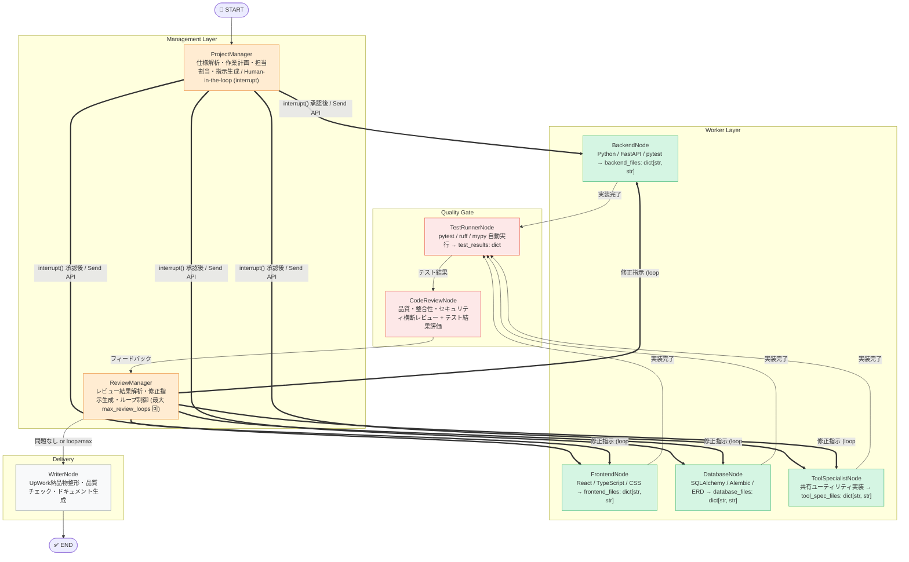
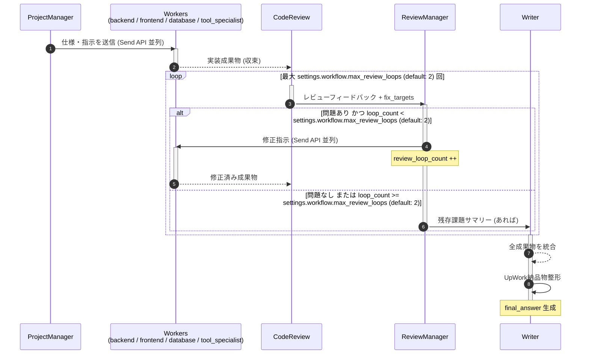
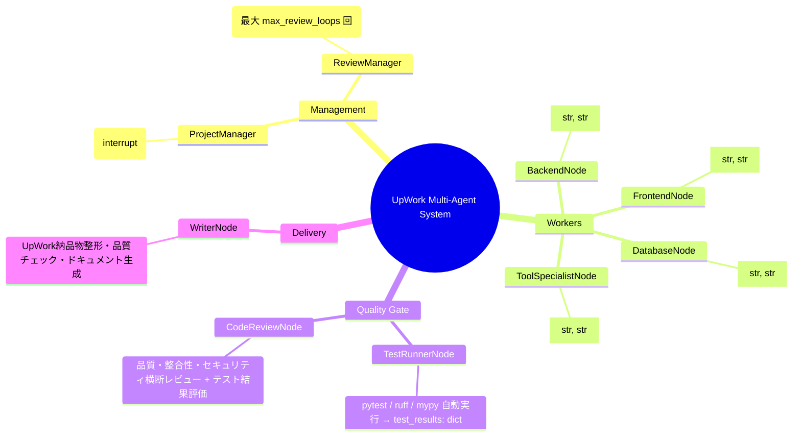
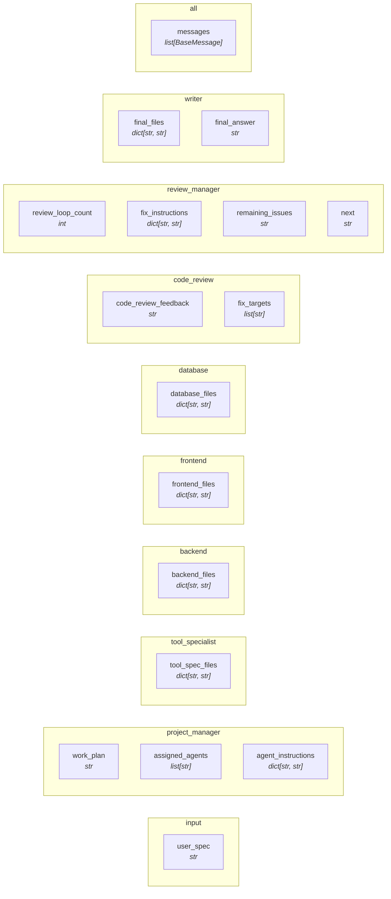

# UpWork Multi-Agent System — Architecture
> **Version:** 1.6.0  |  **Generated:** 2026-06-19 13:20 UTC  |  **Source:** `graph/diagram_spec.py`

> [!WARNING]
> このファイルは自動生成です。直接編集しないでください。
> 変更は `graph/diagram_spec.py` を更新してから `python tools/generate_diagram.py` を実行してください。

---
## 1. システム全体フロー



**凡例**
| 矢印 | 意味 |
|---|---|
| `-->` | 通常遷移 |
| `==>` | Send API 並列実行 |
| `-.->` | オプション (RAG) |
---
## 2. コードレビューループ シーケンス

> 実装 ↔ レビュー のループは最大 **settings.workflow.max_review_loops (default: 2) 回** に制限されます。


---
## 3. エージェント役割 マインドマップ


---
## 4. AgentState データフロー

> 各フィールドがどのエージェントによって書き込まれるかを示します。



### State フィールド一覧

| フィールド | 型 | 書き込みノード | 説明 |
|---|---|---|---|
| `messages` | `list[BaseMessage]` | `all` | 会話履歴 (add_messages reducer) |
| `user_spec` | `str` | `input` | UpWork クライアント仕様テキスト |
| `work_plan` | `str` | `project_manager` | 作業計画書 |
| `assigned_agents` | `list[str]` | `project_manager` | 担当エージェント名リスト |
| `agent_instructions` | `dict[str, str]` | `project_manager` | エージェント別指示文 |
| `human_feedback` | `str` | `human` | interrupt() で受け取る承認/修正指示 |
| `tool_spec_files` | `dict[str, str]` | `tool_specialist` | 共有ユーティリティ成果物 |
| `backend_files` | `dict[str, str]` | `backend` | バックエンド成果物 |
| `frontend_files` | `dict[str, str]` | `frontend` | フロントエンド成果物 |
| `database_files` | `dict[str, str]` | `database` | データベース成果物 |
| `test_results` | `dict[str, Any]` | `test_runner` | pytest/ruff/mypy 実行結果 |
| `code_review_feedback` | `str` | `code_review` | 横断コードレビュー結果 |
| `fix_targets` | `list[str]` | `code_review` | 修正が必要なエージェントリスト |
| `review_loop_count` | `int` | `review_manager` | レビューループ回数 (上限 max_review_loops) |
| `fix_instructions` | `dict[str, str]` | `review_manager` | エージェント別修正指示文 |
| `remaining_issues` | `str` | `review_manager` | ループ上限後の残存課題 |
| `next` | `str` | `review_manager` | ルーティングシグナル (fix | writer) |
| `final_files` | `dict[str, str]` | `writer` | 全納品ファイル (merge済み) |
| `final_answer` | `str` | `writer` | UpWork 提出フォーマット納品物 |
---
## 5. @tool カタログ

> 全エージェント合計 **50 ツール**

| エージェント | @tool 一覧 | 数 |
|---|---|---|
| **ProjectManager** | `parse_requirements` / `create_work_plan` / `assign_agents` / `incorporate_human_feedback` | 4 |
| **ReviewManager** | `prioritize_issues` / `generate_fix_instruction` / `should_escalate` / `summarize_remaining_issues` | 4 |
| **BackendNode** | `design_api` / `write_python_code` / `write_tests` / `write_requirements` / `generate_dockerfile` / `apply_fix` | 6 |
| **FrontendNode** | `design_ui` / `write_html_css` / `write_javascript` / `generate_components` / `integrate_api` / `generate_build_config` / `apply_fix` | 7 |
| **DatabaseNode** | `design_erd` / `generate_sqlalchemy_models` / `generate_alembic_migration` / `generate_repository` / `optimize_queries` / `generate_seed_data` / `generate_db_config` / `apply_fix` | 8 |
| **ToolSpecialistNode** | `analyze_utility_requirements` / `implement_utility` / `generate_error_handling` / `generate_logging_config` / `generate_validation_utils` / `apply_fix` | 6 |
| **TestRunnerNode** | `write_files_to_tempdir` / `run_pytest` / `run_ruff_check` / `run_mypy` | 4 |
| **CodeReviewNode** | `review_files` / `evaluate_test_results` / `check_cross_consistency` / `check_security` / `identify_fix_targets` / `generate_feedback_summary` | 6 |
| **WriterNode** | `merge_all_files` / `write_readme` / `write_handover_doc` / `quality_check` / `format_for_upwork` | 5 |
---
## 6. ディレクトリ構造

```
test-BBQ/
│
    ├── Agent_Node.py                            # 基底クラス: @tool自動収集・LLMバインド・ContextManager
        ├── context_manager.py                       # ContextManager: メッセージトリム・アーティファクト要約
        ├── project_manager_node.py                  # 最上位オーケストレーター + Human-in-the-loop
        ├── backend_node.py                          # Python/FastAPI専門 → backend_files: dict[str,str]
        ├── frontend_node.py                         # フロントエンド専門 → frontend_files: dict[str,str]
        ├── database_node.py                         # DB設計・実装専門 → database_files: dict[str,str]
        ├── tool_specialist_node.py                  # 共有ユーティリティ実装 → tool_spec_files: dict[str,str]
        ├── test_runner_node.py                      # pytest/ruff/mypy 自動実行 → test_results: dict
        ├── code_review_node.py                      # 横断コードレビュー + テスト結果評価
        ├── review_manager_node.py                   # レビューループ制御 (max_review_loops)
        ├── writer_node.py                           # 納品物整形 → final_files + final_answer
│
    ├── settings.py                              # 設定 (LLM/AWS/Workflow)
    ├── systemMessage.py                         # 全エージェントのシステムプロンプト
│
    ├── workflow.py                              # LangGraph StateGraph + MemorySaver定義
    ├── diagram_spec.py                          # 図の単一情報源 (ここを更新) ★
│
    ├── secrets_manager.py                       # AWS Secrets Manager クライアント (TTLキャッシュ)
    ├── secret_keys.py                           # シークレット名定数
│
    ├── generate_diagram.py                      # Mermaid図自動生成スクリプト ★
│
    ├── architecture.md                          # 生成されたアーキテクチャ図 (自動更新) ★
├── pyproject.toml                           # uv依存関係管理 (本番+開発) ★
├── uv.lock                                  # uv ロックファイル (自動生成・要コミット)
├── .python-version                          # Pythonバージョン固定 (3.11)
├── .env.example                             # 非機密設定テンプレート
├── main.py                                  # エントリポイント・DI組み立て・MemorySaver注入
```
---
## 7. 更新手順

システムにエージェント・ノード・ステートを追加したときの手順:

```bash
# 1. diagram_spec.py を更新 (NODES / EDGES / STATE_FIELDS)
vim graph/diagram_spec.py

# 2. Mermaid図を再生成
python tools/generate_diagram.py

# 3. コミット
git add graph/diagram_spec.py docs/architecture.md
git commit -m "docs: アーキテクチャ図更新"
```

---

*Auto-generated by `tools/generate_diagram.py` — UpWork Multi-Agent System v1.6.0*
